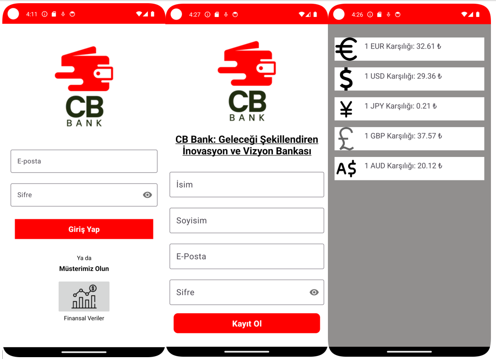
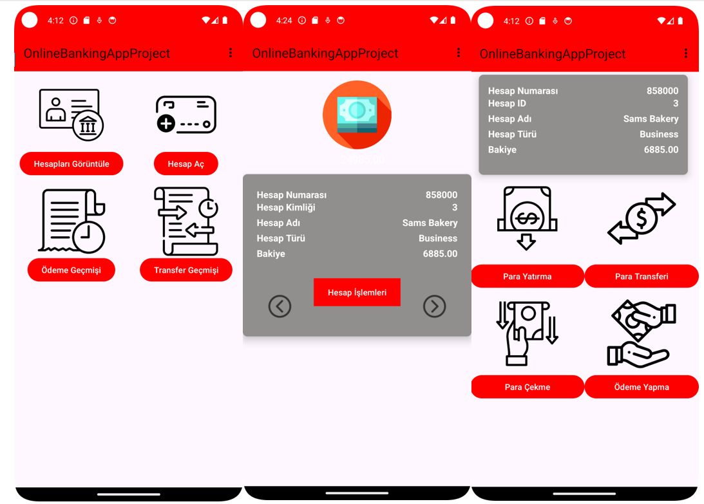

# Android Online Banking App

## Overview

This Android application is developed in Java as part of the Android Programming course. The primary goal of this program is to implement a banking system, utilizing a custom API developed for this purpose. In this application, users can register with the bank, log in, and access financial data even without logging in. Upon logging in, users can view their accounts, create new accounts, access payment history, and view transfer history.

## Features

- **User Authentication:**
  - Users can register with the bank.
  - Users can log in to their accounts.
  - Non-logged-in users can access financial data.

- **Account Management:**
  - Users can view their accounts.
  - Users can create new accounts.

- **Transaction History:**
  - Users, upon logging in, can access their payment history.
  - Users can view their transfer history.

- **Account Operations:**
  - In the account viewing section, users can perform various operations on their accounts:
    - Withdraw money.
    - Deposit money.
    - Make payments.
    - Initiate transfers.

## Custom API

We leverage our custom API for the backend functionality of this application. The API repository can be found [here](https://github.com/Berko01/Advanced-Full-Stack-Project-With-Java-Spring-Boot-And-React-Redux-Online-Banking/tree/master/Online%20Banking%20App%20Spring%20Boot). It is a comprehensive Full Stack project developed with Java Spring Boot and React Redux, specifically designed for online banking applications.

## Some Screenshots
## Screenshots

## Getting Started

To use the Android Banking App, follow these steps:

1. Clone the project to your local machine.
2. Build and run the application using your preferred Android development environment.
3. Ensure that the custom API is set up and running to handle backend operations.

## Contribution

If you'd like to contribute to the project, feel free to fork the repository, make your changes, and submit a pull request.
